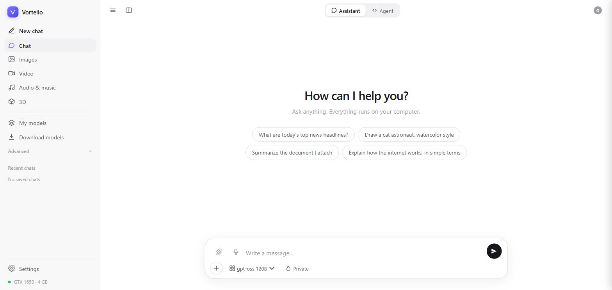
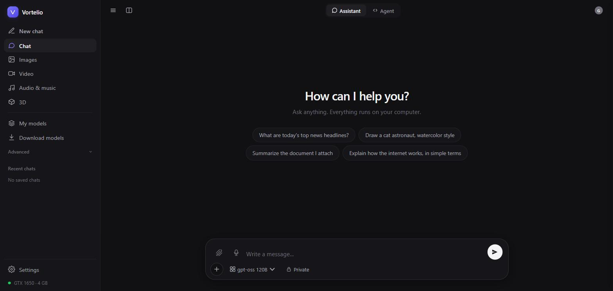
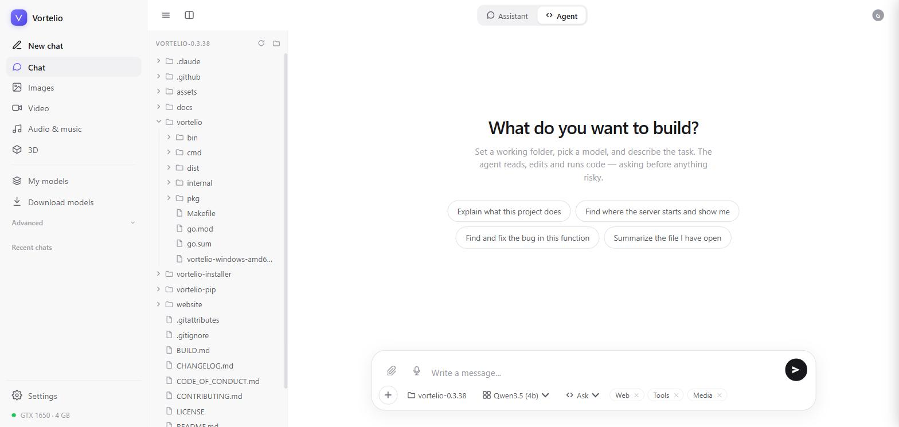
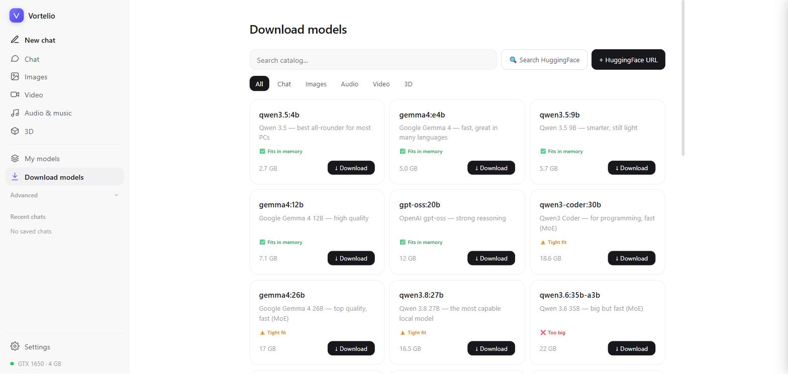

<div align="center">


# Vortelio — Run AI Locally. Every Modality. One Binary.

**Vortelio is an open-source, local AI platform** that lets you run LLMs, generate images with Stable Diffusion, transcribe audio with Whisper, create video, build 3D models, and orchestrate multi-agent AI workflows — all on your own machine, with no cloud, no API keys, and no subscriptions.

**The best open-source Ollama alternative** with built-in image generation, audio, video, 3D, and multi-agent support via CrewAI.

[](https://github.com/metiu1/Vortelio/releases)
[](LICENSE)
[](https://pypi.org/project/vortelio/)
[](https://github.com/metiu1/Vortelio/releases)
[](https://github.com/metiu1/Vortelio/stargazers)
[](https://goreportcard.com/report/github.com/metiu1/Vortelio)
[](https://github.com/metiu1/Vortelio/actions)

[Install](#-install) • [Quickstart](#-quickstart) • [Features](#-features) • [Models](#-supported-models) • [API](#-api) • [CrewAI](#-crewai-orchestration) • [Contributing](#-contributing)

<br/>



</div>

---

## What is Vortelio?

**Vortelio** is a self-hosted, offline AI platform that replaces Ollama, ComfyUI, Whisper UIs, and CrewAI cloud services with a single Go binary and a built-in web interface.

- **Run LLMs locally** (Llama, Mistral, Qwen, Phi, Gemma — any GGUF model from HuggingFace)
- **Generate images locally** (Stable Diffusion 1.5, SDXL, FLUX.1 — no Replicate, no Midjourney)
- **Transcribe audio offline** (Whisper large-v3, local speech-to-text, no OpenAI key needed)
- **Text-to-speech locally** (Kokoro TTS, Bark — no ElevenLabs subscription)
- **Generate video locally** (WAN 2.1, AnimateDiff, CogVideo-X)
- **3D generation** (TripoSR, Shap-E — image-to-3D or text-to-3D)
- **Multi-agent AI workflows** (CrewAI orchestration using your local models — no OpenAI key)
- **OpenAI-compatible API** — drop-in replacement for existing OpenAI SDK code

> Vortelio is the answer to: *"How do I run AI locally without setting up 5 different tools?"*

---

## Vortelio vs Ollama vs LM Studio vs ComfyUI

| Feature | **Vortelio** | Ollama | LM Studio | ComfyUI |
|---|:---:|:---:|:---:|:---:|
| Run LLMs (Llama, Mistral, Qwen…) | ✅ | ✅ | ✅ | ❌ |
| Local image generation (SD/FLUX) | ✅ | ❌ | ❌ | ✅ |
| Local audio — Whisper STT | ✅ | ❌ | ❌ | ❌ |
| Local TTS — Kokoro / Bark | ✅ | ❌ | ❌ | ❌ |
| Local video generation (WAN 2.1) | ✅ | ❌ | ❌ | ⚠️ |
| Local 3D generation (TripoSR) | ✅ | ❌ | ❌ | ❌ |
| Web UI included | ✅ | ❌ | ✅ | ✅ |
| OpenAI-compatible API | ✅ | ✅ | ✅ | ❌ |
| Ollama-compatible API | ✅ | ✅ | ❌ | ❌ |
| Cloud proxy (OpenAI, Anthropic…) | ✅ | ❌ | ❌ | ❌ |
| CrewAI multi-agent orchestration | ✅ | ❌ | ❌ | ❌ |
| Background server + stop command | ✅ | ✅ | ❌ | ❌ |
| Single binary, no Docker | ✅ | ✅ | ❌ | ❌ |

**→ Ollama only runs LLMs.** Vortelio runs LLMs *plus* images, audio, video, 3D — and stays Ollama-compatible so your existing tools work unchanged.

---

### Who uses Vortelio

- 👩‍💻 **Developers** — local OpenAI-compatible API, no bills, no rate limits, works offline
- 🏢 **Enterprises** — GDPR / HIPAA compliance, data never leaves your server
- 🎨 **Creators** — Stable Diffusion + FLUX locally, no watermarks, no monthly limits
- 🔬 **Researchers** — reproducible experiments, offline, air-gapped environments
- 🕹️ **Hobbyists** — put that gaming GPU to work

---

## 🚀 Install

### 0. Install `uv` first (required)

Vortelio is installed and updated through [`uv`](https://docs.astral.sh/uv/). Install it once:

```bash
# Windows (PowerShell)
powershell -ExecutionPolicy ByPass -c "irm https://astral.sh/uv/install.ps1 | iex"

# macOS / Linux
curl -LsSf https://astral.sh/uv/install.sh | sh

# …or, if you already have Python/pip
pip install uv
```

Close and reopen your terminal so `uv` is on your `PATH`, then continue below.

### 1. Install Vortelio (cross-platform, recommended)

```bash
uv tool install "git+https://github.com/metiu1/Vortelio#subdirectory=vortelio-pip"
vortelio gui
```

### Update Vortelio

Always update from inside Vortelio — it stops the running server first, so the
install never breaks:

```bash
vortelio update          # CLI
```

…or click **🔄 Update Vortelio** in the menu / **Update** in the web UI.
A notification appears automatically when a new version is available. Avoid
re-running `uv tool install` by hand while Vortelio is open.

To install new versions automatically, turn on **Settings → Updates → Auto-update**
or run `vortelio update --auto on`: the server updates itself when idle and restarts.

### Windows installer

Download `Vortelio-Setup-x.y.z.exe` from [Releases](https://github.com/metiu1/Vortelio/releases) → double-click.

### Build from source

```bash
git clone https://github.com/metiu1/Vortelio
cd Vortelio/vortelio
go build -o vortelio ./cmd/vortelio
./vortelio gui
```

---

## ⚡ Quickstart

```bash
# Open the web UI (auto-starts background server)
vortelio gui

# Pull a model (llama.cpp is downloaded automatically on first use)
vortelio pull llm/qwen3.5:4b

# Run inference from the CLI
vortelio run llm/qwen3.5:4b "Explain quantum entanglement in one tweet"

# Serve OpenAI / Ollama compatible API
vortelio serve --port 11500

# Serve in background (detached process)
vortelio serve --bg
vortelio stop           # graceful shutdown

# Use it from any OpenAI SDK
curl http://localhost:11500/v1/chat/completions \
  -d '{"model":"qwen3.5:4b","messages":[{"role":"user","content":"hi"}]}'
```

---

## 💻 Vortelio Code — coding agent in your terminal

`vortelio code` is an interactive coding agent in the style of Claude Code, Codex and
OpenCode, running on your local models (or a cloud key you already have).

```bash
cd my-project
vortelio code                          # interactive session
vortelio code "fix the failing tests"  # start with a prompt
vortelio code -p "explain main.go"     # one-shot, prints the answer (scripts / CI)
vortelio code -c                       # continue the last session in this folder
vortelio code --plan                   # read-only: investigate and propose a plan
```

- **Tools** — read (numbered, paged), edit (exact unique match, colored diff), write, glob `**`,
  regex grep, shell with timeout, todo list, web search/fetch, `ask_user`; MCP and media optional.
- **Permission modes** (Shift+Tab) — `plan` read-only · `ask` confirm edits and commands ·
  `edits` accept edits, ask for commands · `auto` no prompts. Allow/deny rules such as
  `run_shell(go test*)` in `.vortelio/settings.json`; deny always wins.
- **Project memory** — `AGENTS.md` (also `CLAUDE.md` / `VORTELIO.md`) loaded every session;
  `/init` writes it, `# note` appends to it.
- **Sessions** — saved automatically; `/resume`, `-c`, `-r <id>`. `/compact` (also automatic
  when the context fills up), `/undo` reverts the last turn's file changes, `/diff`.
- **Models** — `/model` picks a local model or a free-plan cloud model (Gemini, Groq, Mistral,
  OpenRouter, Ollama Cloud); "＋ Custom model…" adds any model from any provider you have a key for.
- **Input** — `@file` attaches a file, `!cmd` runs a shell command, `Esc` interrupts,
  custom commands from `.vortelio/commands/*.md`; `Ctrl+O` shows the reasoning of thinking models.

`/help` lists every command; `/config` and `/permissions` show and change the settings.

---

## ✨ Features

- 🧠 **LLMs** — llama.cpp backend (installed and kept up to date automatically, so new model architectures just work), GGUF, chat + completions, streaming
- 🎨 **Images** — Stable Diffusion, FLUX, SDXL via `diffusers`
- 🎤 **Audio** — Whisper STT (faster-whisper), Kokoro/Bark TTS
- 🎬 **Video** — WAN 2.1, AnimateDiff, CogVideo
- 🧊 **3D** — TripoSR, Shap-E, LGM, TRELLIS
- 🌐 **Web UI** — clean, minimal single-file UI, light & dark theme, code blocks, streaming; Agent → Developer mode with file explorer, working folder and approvals for risky actions
- 🔌 **API compatibility** — drop-in for OpenAI `/v1/chat/completions` and Ollama `/api/chat`
- ☁️ **Cloud proxy** — OpenAI, Anthropic, Gemini, Groq, Mistral, OpenRouter, Ollama Cloud
- 🤖 **AI agents** — install/start/stop OpenClaw, Open Code, Open WebUI, Flowise, CrewAI from the UI
- 🫂 **CrewAI orchestration** — build multi-agent teams with visual crew builder, run task pipelines locally using your own models
- 🔄 **Background mode** — `vortelio serve --bg` to run headless; `vortelio stop` for graceful shutdown
- 🔐 **Local auth** — email+password, Google OAuth, session in browser
- ⚙️ **Hardware aware** — auto-detects CUDA, ROCm, Metal, CPU
- 📦 **Zero-config** — one binary, models in `~/.vortelio/`

---

## 🧩 Supported models

LLM: Qwen 3.5 / 3.6 / 3.8, Qwen3 Coder, Gemma 4, gpt-oss, Llama, Mistral, Phi — any GGUF llama.cpp can run. Image: Stable Diffusion 1.5/2/XL, FLUX.1, Kandinsky. Audio: Whisper (all sizes), Kokoro, Bark. Video: WAN 2.1, AnimateDiff, CogVideo-X. 3D: TripoSR, Shap-E, LGM, TRELLIS.

Pull anything from HuggingFace:

```bash
vortelio pull <org>/<repo>
```

---

## 🌐 API

OpenAI-compatible:

```bash
POST /v1/chat/completions
POST /v1/embeddings
POST /v1/images/generations
POST /v1/audio/transcriptions
POST /v1/audio/speech
```

Ollama-compatible:

```bash
POST /api/chat
POST /api/generate
GET  /api/tags
```

Native:

```bash
GET  /api/status                        # hardware, version, model count
POST /api/pull                          # download model (SSE progress)
POST /api/generate                      # run any model type (SSE)
POST /api/agents/install                # install AI agent (npm/pip)
POST /api/agents/start                  # start agent subprocess
POST /api/agents/stop                   # stop agent subprocess
GET  /api/crewai/crews                  # list saved crew definitions
POST /api/crewai/crews/{name}           # save/update a crew definition
POST /api/crewai/crews/{name}/run       # run crew (SSE output stream)
DELETE /api/crewai/crews/{name}         # delete crew definition
POST /api/shutdown                      # graceful server shutdown
```

Full route list in [`vortelio/internal/server/server.go`](vortelio/internal/server/server.go).

---

---

## 🤖 CrewAI Orchestration

Vortelio integrates [CrewAI](https://github.com/crewAIInc/crewAI) as a built-in agent — build teams of AI agents that collaborate to complete complex tasks, all running against your **local models**.

### Setup

```bash
# In the Web UI → Agenti AI → CrewAI → Installa
# Or from TUI: CrewAI Orchestration → Install CrewAI

# Or manually:
pip install crewai fastapi uvicorn
vortelio serve   # CrewAI server auto-starts when you click Start in the UI
```

### Visual crew builder

Open **Web UI → 🤖 CrewAI** (sidebar) or click **Gestisci Crew** on the running agent card:

1. **New Crew** → give it a name, pick a local model (e.g. `qwen3.5:4b`), choose `sequential` or `hierarchical`
2. **Add agents** — define role, goal, backstory for each
3. **Add tasks** — description, expected output, assign to an agent
4. **Save & Run** — output streams live in the UI

### API

```bash
# List saved crews
GET http://localhost:11500/api/crewai/crews

# Save a crew definition
POST http://localhost:11500/api/crewai/crews/research_team
{
  "name": "research_team",
  "model": "qwen3.5:4b",
  "process": "sequential",
  "agents": [
    {"role": "Researcher", "goal": "Find key facts about X", "backstory": "Expert analyst"},
    {"role": "Writer",     "goal": "Write a clear summary", "backstory": "Technical writer"}
  ],
  "tasks": [
    {"description": "Research topic X",       "expected_output": "Bullet list of facts", "agent_role": "Researcher"},
    {"description": "Write a 300-word report","expected_output": "Markdown report",      "agent_role": "Writer"}
  ]
}

# Run the crew (SSE stream)
POST http://localhost:11500/api/crewai/crews/research_team/run
{"model": "qwen3.5:4b", "inputs": {"topic": "quantum computing"}}
```

> CrewAI runs on **port 8500** (local only). All LLM calls go to Vortelio's OpenAI-compatible API — no external API keys required.

---

---

## 🔌 Use Vortelio with any OpenAI SDK, LangChain or LlamaIndex

Vortelio exposes an OpenAI-compatible API. **No code changes needed** — just change the `base_url`.

### Python (OpenAI SDK)

```python
from openai import OpenAI

client = OpenAI(base_url="http://localhost:11500/v1", api_key="local")

# Chat with a local LLM
response = client.chat.completions.create(
    model="qwen3.5:4b",
    messages=[{"role": "user", "content": "Explain quantum computing in simple terms"}]
)
print(response.choices[0].message.content)

# Generate an image locally (no Midjourney, no DALL-E)
image = client.images.generate(model="image/dreamshaper:latest", prompt="a cat on the moon")

# Transcribe audio locally (no OpenAI key)
audio = client.audio.transcriptions.create(model="audio/whisper:large-v3", file=open("audio.mp3","rb"))
```

### LangChain

```python
from langchain_openai import ChatOpenAI

llm = ChatOpenAI(base_url="http://localhost:11500/v1", api_key="local", model="qwen3.5:4b")
result = llm.invoke("What is the capital of Italy?")
```

### Node.js / TypeScript

```typescript
import OpenAI from "openai";

const client = new OpenAI({ baseURL: "http://localhost:11500/v1", apiKey: "local" });
const chat = await client.chat.completions.create({
  model: "qwen3.5:4b",
  messages: [{ role: "user", content: "Hello!" }],
});
```

### curl

```bash
curl http://localhost:11500/v1/chat/completions \
  -H "Content-Type: application/json" \
  -d '{"model":"qwen3.5:4b","messages":[{"role":"user","content":"Hello!"}],"stream":false}'
```

---

## 🖥️ Screenshots

| Chat | Dark theme |
|---|---|
|  |  |





---

## 🛠️ Tech stack

Go (server, CLI, llama.cpp wrapper) · Python (diffusers, faster-whisper, kokoro-onnx) · vanilla JS (UI, single HTML) · NSIS (Windows installer) · `uv` / hatchling (Python wrapper).

---

## 🤝 Contributing

PRs welcome. See [CONTRIBUTING.md](CONTRIBUTING.md) and [CODE_OF_CONDUCT.md](CODE_OF_CONDUCT.md). Report security issues per [SECURITY.md](SECURITY.md).

```bash
git clone https://github.com/metiu1/Vortelio
cd Vortelio/vortelio
go test ./...
```

---

## 📜 License

[Apache 2.0](LICENSE) © Vortelio Contributors

---

## ❓ FAQ

**Is Vortelio free and open source?**
Yes. Apache 2.0 license. No paid tier, no telemetry, no account required.

**How do I run LLMs locally for free?**
Install Vortelio, then `vortelio pull llm/qwen3.5:4b` and `vortelio run llm/qwen3.5:4b "your prompt"`. No API key, no cloud, no cost.

**How is Vortelio different from Ollama?**
Ollama only runs LLMs. Vortelio runs LLMs **plus** Stable Diffusion image generation, Whisper speech-to-text, Kokoro text-to-speech, WAN 2.1 video, TripoSR 3D — all from one binary. Vortelio also exposes Ollama-compatible API so your existing Ollama clients work unchanged.

**Can I use Vortelio as a local Stable Diffusion alternative?**
Yes. `vortelio pull image/dreamshaper:latest` then `vortelio run image/dreamshaper:latest "a cat in space"`. No Automatic1111 setup, no Docker, no Python environment.

**How do I run Whisper locally without OpenAI?**
`vortelio pull audio/whisper:large-v3` then `vortelio run audio/whisper:large-v3 --input audio.mp3`. Fully offline, no OpenAI API key needed.

**Can I use Vortelio with LangChain / LlamaIndex / OpenAI SDK?**
Yes. Vortelio serves OpenAI-compatible endpoints at `http://localhost:11500/v1/`. Change `base_url` to `http://localhost:11500/v1` and `api_key` to any string. Supports `/v1/chat/completions`, `/v1/embeddings`, `/v1/images/generations`, `/v1/audio/transcriptions`.

**Does CrewAI work locally without OpenAI API key?**
Yes. Vortelio runs CrewAI agents against your local models. No external API keys needed. Set model to any model you've pulled (e.g. `qwen3.5:4b`).

**Does it work without a GPU?**
LLMs and Whisper run on CPU (slower but functional). Image, video, and 3D generation need a GPU — NVIDIA CUDA, AMD ROCm, or Apple Metal.

**Does it support Apple Silicon (M1/M2/M3/M4)?**
Yes — Metal acceleration via llama.cpp for LLMs, MPS backend for diffusers (images).

**How do I run Vortelio in the background?**
`vortelio serve --bg` — detached process, PID saved to `~/.vortelio/vortelio.pid`. Stop with `vortelio stop`.

**Can I self-host Vortelio for my team?**
Yes. `vortelio serve --remote --port 11500` exposes the API on your LAN. Optionally protect with `--api-key yourkey`.

**Where are models and data stored?**
Models: `~/.vortelio/`. Chat history: browser `localStorage` only. Nothing is sent externally unless you explicitly enable a Cloud provider.

**Can I run it offline / air-gapped?**
Yes. Pull models once, copy `~/.vortelio/` to the air-gapped machine, run.

---

## ⭐ Star history

[](https://star-history.com/#metiu1/Vortelio&Date)

<div align="center">

**[Website](https://github.com/metiu1/Vortelio) • [Releases](https://github.com/metiu1/Vortelio/releases) • [Issues](https://github.com/metiu1/Vortelio/issues) • [Discussions](https://github.com/metiu1/Vortelio/discussions)**

Made with ⚡ by the Vortelio community.

</div>

---

<details>
<summary>🔍 Keywords / topics</summary>

`local ai` · `run ai locally` · `local llm` · `run llm locally` · `offline ai` · `self-hosted ai` · `private ai` · `ollama alternative` · `ollama alternative with image generation` · `local stable diffusion` · `run stable diffusion locally` · `local whisper` · `run whisper locally` · `local image generation` · `local text to speech` · `crewai local` · `crewai without openai` · `multi-agent local` · `ai orchestration local` · `openai api compatible` · `langchain local` · `free chatgpt alternative` · `self hosted chatgpt` · `no api key ai` · `background ai server` · `local multimodal ai` · `lm studio alternative` · `gpt4all alternative` · `jan ai alternative` · `localai alternative` · `open source chatgpt` · `chatgpt local` · `claude local` · `llama local` · `mistral local` · `qwen local` · `gemma local` · `phi local` · `llama.cpp` · `gguf` · `huggingface` · `stable diffusion local` · `flux local` · `sdxl local` · `text to image local` · `image generation offline` · `whisper local` · `speech to text offline` · `tts local` · `text to speech offline` · `kokoro tts` · `bark tts` · `wan 2.1 local` · `text to video local` · `animatediff` · `cogvideo` · `text to 3d` · `image to 3d` · `triposr` · `shap-e` · `lgm` · `trellis` · `openai api compatible` · `openai compatible server` · `ollama api compatible` · `drop-in openai replacement` · `langchain local` · `llamaindex local` · `local rag` · `local embeddings` · `local agent` · `ai agent local` · `openclaw` · `open code agent` · `go ai server` · `golang ai` · `single binary ai` · `windows ai` · `linux ai` · `macos ai` · `apple silicon ai` · `m1 m2 m3 m4 llm` · `cuda llm` · `rocm llm` · `metal llm` · `cpu llm` · `low vram llm` · `quantized llm` · `gguf quantization` · `ai chatbot self-hosted` · `private chatgpt` · `gdpr ai` · `hipaa ai` · `air-gapped ai` · `enterprise ai on-prem` · `data sovereignty ai` · `no api key ai` · `free chatgpt alternative` · `unlimited ai` · `no rate limit ai` · `ai studio` · `multimodal ai` · `omni ai` · `all-in-one ai` · `ai toolkit` · `ai playground` · `local inference` · `edge ai` · `vortelio`

</details>

<!--
SEO meta — indexed in raw view:
title: Vortelio — Run AI Locally | Open Source Ollama Alternative with Image, Audio, Video, 3D and CrewAI
description: Vortelio is the open-source local AI platform. Run LLMs (Llama, Mistral, Qwen), generate images with Stable Diffusion and FLUX, transcribe with Whisper, use CrewAI multi-agent workflows — all offline, one binary, OpenAI and Ollama API compatible.
keywords: vortelio, local ai platform, run llm locally, run ai locally, local llm, ollama alternative, lm studio alternative, comfyui alternative, open source ai, self-hosted ai, private ai, offline ai, local stable diffusion, run stable diffusion locally, flux local, local image generation ai, whisper local, run whisper locally, local speech to text, offline transcription, kokoro tts local, local text to speech, wan 2.1 local, local video generation ai, triposr local, local 3d generation ai, crewai local models, crewai without openai, crewai ollama, multi-agent ai local, local ai orchestration, openai api compatible, ollama api compatible, openai drop-in replacement, langchain local, llamaindex local, local rag, local embeddings, local ai agents, self-hosted chatgpt, free chatgpt alternative, private chatgpt, gdpr ai, hipaa ai, air-gapped ai, offline ai platform, go ai server, golang ai, single binary ai, windows ai, linux ai, macos ai, apple silicon llm, m1 m2 m3 m4 ai, cuda llm, rocm llm, metal llm, cpu llm, gguf, huggingface local, multimodal ai, all-in-one ai, local inference server, edge ai, no api key ai, no subscription ai
-->

